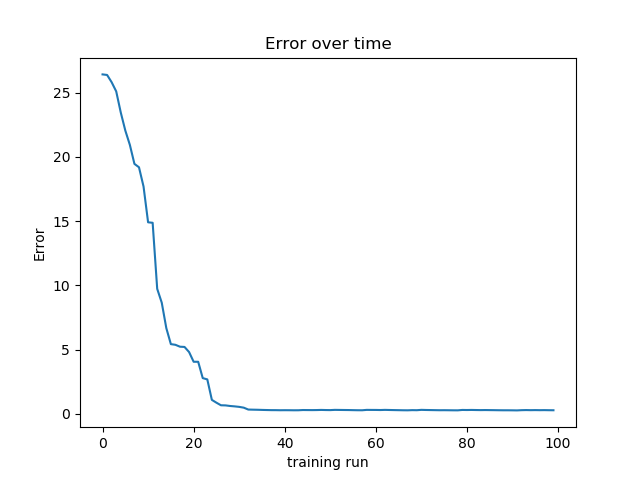

## Polynomial Approximation

This code uses the neural network MazeX to approximate a polynomial. Many different network setups can be used to model this 
simple problem but here we use a network with 1 input, 1 hidden layer(20 nodes), and 1 output to approximate a y = f(x) function 
given in the code. The code comments should make the code easily understandable.

A quick run of the code gave the following learning curve:

  

