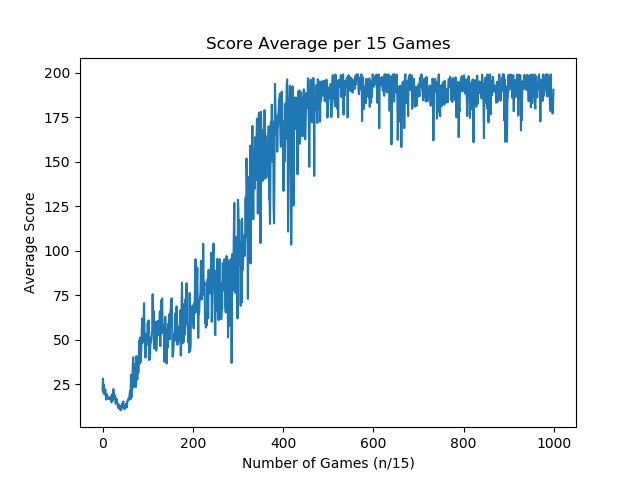

# Machine Learning Examples

This folder contains example usage of the repositories machine learning code to solve various machine learning problems. The various examples are breifly explained below.

## Polynomial Approximation

This code uses the neural network MazeX to approximate a polynomial. Many different network setups can be used to model this simple problem but here we use a network with 1 input, 1 hidden layer(20 nodes), and 1 output to approximate a y = f(x) function given in the code. The code comments should make the code easily understandable.

## CartPole

Cart Pole is a game of balance. The goal is to keep a pole balanced on a cart by exerting force either left or right on the cart. To be considered "solved" the learning agent needed to be able to consistantly balance the pole for 200 frames for at least 100 games in a row without failing once. In this example I used openai's gym environment and a DQN based on MazeX to learn the game. The network used to learn the game had the following layout:

```
MazeX([4, 64, 128, 256, 128, 64, 2], ['relu', 'relu', 'relu', 'relu', 'relu', 'lin'], learning_constant=0.0001)
```

 The weights given here as "CartPoleLearnedWeights.npy" were learned during a 15000 game training run which took 73 minutes on a geforce GTX 1070, and i5 3.3ghz processor.  

<p align="center">
  
</p>
 
As can be seen in the above average score graph, the game was mastered after about 8000-9000 games. However, after multiple runs this varied from 8000 to greater than 15000. The weight set given here was the best result of the runs as it got higher scores when run past 200 frames than other network weights that solved the game.
 
 The code of the DQN agent used can be seen in "rn_cartpole.py" but the basic idea was as follows:
 1. Pick action based on network or random.
 2. Take action and use result to update network.
 3. Continue till game finished.
 4. If the score was higher than the mean of all scores + 0.5 standard devation, than store the moves made for replay training.
 5. Train on the stored action/observation memory of past games
 6. Start another game.
 
 To use the learned wieghts to play the game use the MazeX method "load_weights" with a network of the same layout as above. An example of this is given in the "cartpoleplay.py" script.
